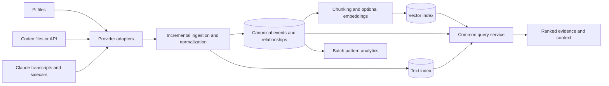

# Session history search design

Status: proposed design, not implemented. Scope: local and imported Pi, Codex,
and Claude Code histories; a Python library and CLI first, with a service interface
possible later. Provider here means the agent harness, not its underlying model API.

## 1. Main decision

Build `thearc.learning` as an event archive and search service. Separate source
discovery, provider parsing, normalization, storage, retrieval, and analytics.
Search individual messages and actions first; group results into sessions when
requested. Every result must point back to the original evidence.



The canonical store and text index should initially share one SQLite database.
Vector indexing is optional and replaceable. Source histories are read-only.

## 2. Fit with the current code

`thearc/models/session.py` currently loads complete files into memory, heuristically
classifies top-level fields, aggregates whole sessions, recomputes TF-IDF for
queries, and compares all session pairs. This is useful as a prototype, but:

- Nested provider content is not reliably interpreted by a generic field heuristic.
- Message roles, call arguments/results, branches, and child-agent identity are lost.
- Filename stems are not globally unique session identities.
- Whole-session similarity dilutes a short relevant action inside a long session.
- Pair comparison costs O(N²), and clustering currently depends on input order.
- Both empty tool sets receive perfect Jaccard similarity, creating a similarity
  contribution without evidence of shared actions.

Design the new module independently. Compatibility with `SessionSearchEngine`
is explicitly not an objective: there is no required wrapper, preservation of
existing exports, or constraint on the new search result contract. The existing
prototype informs the problem analysis only.

Proposed layout:

```text
thearc/learning/
  models.py              # Canonical records, queries, responses
  service.py             # Public HistoryService facade
  adapters/
    base.py              # Protocol and capability descriptions
    pi.py
    codex.py
    claude.py
  ingest.py              # Cursors, transactions, reconciliation
  normalize.py           # Tool/action mapping and provenance rules
  stores/
    base.py
    sqlite.py
  retrieval/
    lexical.py
    semantic.py
    hybrid.py
    context.py
  analytics/
    sequences.py
    aggregates.py
    similarity.py
```

## 3. Canonical records

Use Pydantic models consistent with the repository. Preserve nullable fields:
missing information must remain unknown, rather than become invented defaults.

| Record | Important fields |
| --- | --- |
| SourceInstance | id, harness, host_id, owner_id, configured root, access scope |
| SourceArtifact | id, instance_id, URI, generation, fingerprint, parser version, last indexed offset, availability |
| Session | id, native_id, instance_id, workspace_id, cwd, start/end timestamps, title, completeness |
| AgentRun | id, session_id, native_agent_id, parent_run_id, root_run_id, model, status |
| Event | id, session_id, run_id, native_id, sequence, timestamp, kind, role, text, content blocks, native type, provenance |
| ToolInvocation | id, run_id, call_event_id, native_call_id, native name, action kind, arguments, status, result references |
| Relation | from_id, to_id, kind, evidence_event_ids, observed/inferred, confidence, resolution status |
| SourceReference | artifact_id, generation, byte range or API item ID, line, JSON pointer, content hash |
| SearchChunk | id, event IDs, field, text range, chunk policy version, content hash |

The provenance field includes one or more SourceReferences. One provider record
may normalize into several events; one logical event may have multiple source
representations. Retain raw native fields separately from normalized fields.

**Identity:** use source-instance + native session ID for sessions, not bare UUIDs
or filenames. A source instance has a stable configured identity; moving its root
does not change every event ID. Use native event IDs where available. Otherwise
derive an occurrence identity from artifact generation, byte offset, and subrecord
index. Content hashes support deduplication, but identical text does not prove that
two events are the same occurrence. Rewritten artifacts need reconciliation;
unresolvable identities are retained with explicit supersession information.

**Event kinds:** `message`, `tool_call`, `tool_result`, `delegation`,
`agent_lifecycle`, `compaction`, `branch_change`, `metadata`, `unknown`.
Roles and kinds are independent: an assistant content block can be a tool call.
Thinking, system instructions, summaries, and execution output are separate fields.
Thinking is indexed only if available and explicitly enabled.

**Action kinds:** `file.read`, `file.write`, `file.patch`, `shell.exec`,
`search.text`, `web.request`, `agent.spawn`, `agent.message`, `agent.wait`,
`agent.cancel`, `custom`, `unknown`. Keep the original tool name and structured
arguments. Mapping rules are versioned. A shell command string does not prove
that every operation mentioned in it actually executed successfully.

**Relations:** `parent_event`, `result_of`, `spawned_by`, `message_to`,
`forked_from`, `summarizes`, `supersedes`. Pi tree parents are not delegation
parents. A result can have several output events; incomplete calls and unresolved
delegation edges are valid records.

**Time and order:** retain source sequence and provider timestamps. Normalize
timestamps to UTC where possible. Do not invent a total causal order across
concurrent runs or different hosts. Graph edges establish causality where known.

**Coverage:** distinguish complete, active, partial, malformed, missing child,
missing tool output, and unavailable source. Absence of a logged failure is not
evidence of success. A delegation request is not evidence that a child started.

## 4. Provider adapter abstraction

Adapters extract evidence; they do not implement relevance ranking.
The conceptual Python interface is:

```python
class HistoryAdapter(Protocol):
    name: str

    def capabilities(self) -> AdapterCapabilities: ...
    def discover(self, config: SourceConfig) -> Iterator[SourceArtifact]: ...
    def read(
        self, artifact: SourceArtifact, cursor: ReadCursor | None
    ) -> Iterator[RecordEnvelope]: ...
    def normalize(self, record: RecordEnvelope) -> NormalizedBatch: ...
```

`RecordEnvelope` carries the parsed object, source locator, schema fingerprint,
and safe checkpoint. `NormalizedBatch` contains entities, relations, and parser
diagnostics. The reader streams; it must not require loading a complete file.
Capabilities describe available branches, results, usage, delegation IDs,
incremental reads, and source evidence. Unsupported features return an explicit
capability result, rather than an empty list indistinguishable from no matches.

Provider responsibilities:

| Harness | Adapter behavior |
| --- | --- |
| Pi | Parse session header and typed entries; preserve `id`/`parentId` and compactions; join tool call IDs with results. Subagent linkage is extension-specific and needs additional recognizers. |
| Codex | Parse versioned rollout envelopes and nested response items; optionally use an app-server importer. Map thread/run relationships and native call IDs; reconcile duplicated message/event representations. Treat internal database filenames as unstable. |
| Claude Code | Parse nested message blocks and tool use/results; discover child transcripts under the parent session; associate large-output sidecars. Preserve native IDs and compaction boundaries. |

Do not treat global prompt recall files as full session transcripts. They may be
imported as a separate low-coverage source when full transcripts are unavailable.
Custom roots are explicit configuration, with documented defaults as convenience.

A Codex API importer is an alternative ingestion path. Its output must deduplicate
against file imports from the same source instance using native identities. It is
not a prerequisite for offline search. Resume/fork/delete APIs are outside this
read-only module's responsibilities.

## 5. Public search interface

```python
history = HistoryService.open(index_path)
history.register_source(SourceConfig(harness="pi", root=pi_root))
report = history.sync()

page = history.search(SearchQuery(
    text="permission denied",
    mode="literal",                 # literal, lexical, semantic, hybrid
    filters=SearchFilters(
        harnesses=["pi", "codex", "claude"],
        kinds=["tool_result"],
        action_kinds=["shell.exec"], # resolved through result_of
    ),
    group_by="session",             # event, run, session
    limit=20,
))

context = history.get_context(page.hits[0].event_id, before=3, after=3)
trace = history.get_delegation_trace(run_id, direction="descendants")
neighbors = history.find_similar(event_id, unit="episode", limit=10)
```

`SearchQuery` supports source/owner/workspace, harness, session/run IDs, date
ranges, roles, event kinds, tool/action kinds, status, branch scope, and descendants.
Unknown action/status matches only if requested. Default branch scope is all stored
evidence, labeled by branch; `active` is an explicit alternative and may be unknown.
Default text scope is messages, tool arguments, and tool results. System scaffolding,
thinking, and compaction summaries are opt-in to avoid repetitive noise. Metadata
has structured filters and an explicit text field scope.

Search modes have different contracts:

- **Literal:** substring matching with explicit case/Unicode rules, then verification
  against canonical field text. Punctuation and short strings must work.
- **Lexical:** token phrases, boolean terms, prefixes, and relevance scoring.
- **Semantic:** similar meaning; no guarantee that the phrase is present.
- **Hybrid:** merge lexical and semantic candidates after applying the same scope.
- **Regex:** separate bounded scan API with timeout, byte budget, and partial-result
  diagnostics. Avoid presenting regex as an indexed operation.

Each `SearchHit` returns event/run/session IDs, field and matched character ranges,
snippet, original source references, native tool and normalized action, match reasons,
component scores, branch/delegation location, and coverage warnings. Scores are
mode-specific relevance values, not probabilities of truth. Literal verification
and semantic relevance must never be represented as the same kind of evidence.

`SearchPage` includes stable cursor, index revision, freshness timestamp,
has_more, total count if computed, and scanned/indexed/missing-source coverage.
Group after retrieving evidence, with a bounded number of excerpts per group.
Overlapping chunks must collapse to the same event rather than inflate results.
Context expansion follows the branch and run, and can also include related call,
result, and delegation events. A timestamp-only neighborhood is insufficient.

The CLI wraps the same interface:

```text
thearc sessions index --source codex --root ~/.codex
thearc sessions search 'permission denied' --mode literal --kind tool_result
thearc sessions search 'fix flaky tests' --mode hybrid --workspace thearc
thearc sessions show EVENT_ID --context 3
thearc sessions trace RUN_ID
thearc sessions patterns --pattern failed-shell-then-patch-then-test
```

CLI syntax is proposed. Natural-language queries can later compile to SearchQuery
and show the interpreted filters; the typed API remains the authoritative contract.

## 6. Incremental ingestion and recovery

1. Discover artifacts and record an authoritative scan manifest for each root.
2. Compare fingerprints and prior generation/checkpoints. Size and mtime alone
   cannot distinguish every replacement; include file identity and content checks.
3. Read only complete records after the last committed byte offset. Hold a partial
   final line for a later read. Quarantine malformed complete records with locators,
   continue when safe, and expose the skipped evidence count.
4. Normalize in bounded batches. Upsert canonical events, text-index changes,
   unresolved references, and checkpoint in the same transaction.
5. Resolve late-arriving call results and child transcripts in a subsequent pass.
6. Queue embeddings by content hash + chunker/model version after text is committed.
7. Retry crashes idempotently. Detect truncation/rewrite/rotation and reconcile a new
   artifact generation. Parser upgrades trigger targeted rebuilds from source.

A watcher is an optimization; periodic scans are the reconciliation mechanism.
Maintain backpressure, limits for giant records, and large-payload references.
Report freshness separately for canonical, text, and vector indexes.

A failed root scan must never be interpreted as mass deletion. Default retention
should mark disappeared sources unavailable and retain indexed evidence, visibly
labeled. A separately configured mirror policy may remove derived records after
an authoritative scan. Explicit purge must cover events, text, vectors, payloads,
caches, and exports under managed retention. Deleted external exports/backups
cannot be assumed erased by an index purge.

## 7. Index and retrieval strategy

Start with relational SQLite tables for sources, sessions, runs, events,
invocations, relations, chunks, checkpoints, and diagnostics. Index frequent filter
columns and relation endpoints. Keep large raw payloads outside hot search rows.

Use FTS5 for lexical search and BM25 ranking. Keep message text, tool arguments,
and output in distinct indexed columns so weighting and filtering are possible.
Maintain FTS and canonical rows atomically; check runtime FTS5 support on startup.
Parameterize SQL and compile the query AST rather than accepting arbitrary SQL.

FTS token phrases are not byte-exact substring searches. A trigram index can help
literal candidates where applicable; verify matches afterward. Very short strings
and unsupported query forms need a bounded fallback scan or explicit budget error.
Define how Unicode normalization and case folding map highlights back to source.

For semantic retrieval, create chunks per message or bounded action episode:
call + result + nearby explanatory message. Long outputs have smaller chunks;
preserve source ranges and truncation flags. Never combine different owners,
branches, or unrelated child runs into one chunk. Label fields in embedding input.
Version embedding model, dimension, chunk policy, and normalization. Do not compare
vectors from incompatible versions. Cache identical embedding inputs while keeping
all source occurrence identities. Estimate cost before a full backfill.

Hybrid retrieval: apply authorization and user scope, retrieve bounded lexical and
vector candidate sets, combine ranks using reciprocal rank fusion, optionally rerank
a small candidate set, deduplicate, diversify by run/session, and expand context.
Raw BM25 and cosine scores should not be added without calibration. Candidate budgets
are configurable and benchmarked. Avoid filtering only after vector top-k: selective
filters can otherwise remove every candidate and destroy recall.

Session similarity is a separate view over representative chunks and actions, with
its own explanation. Do not silently equate shared shell tools with shared intent.

## 7a. Arrow for bulk processing and analytics

Use Arrow as an optional typed batch interface for normalized data and bulk
results. Use Parquet for persistent analytical snapshots. Keep interactive text
retrieval and transactional ingestion checkpoints in the search/canonical store.
Arrow is an in-memory representation and interchange format, not an inverted
text index, an ANN index, or a transactional database.

```text
provider records -> normalization -> bounded canonical batches -> search store
                                             |
                                             v
                                      Arrow RecordBatches
                                             |
                              Parquet snapshots / analytics consumers
```

Recommended API additions:

```python
history.scan_events(filters, columns, batch_size=8192)  # Iterator[RecordBatch]
history.export_dataset(destination, filters, snapshot_revision)
```

These are bulk operations; ordinary search still returns bounded SearchPages.
An explicit optional `arrow` dependency extra keeps installation lightweight for
users who only need local search. Put conversion and export in a dedicated
`columnar.py` module, sharing the canonical field/schema definitions.

Benefits include bounded-memory scans, projection of only needed columns,
vectorized filtering/aggregation, and interoperability with analytical engines
and dataframe tools. Arrow datasets can scan Parquet in batches and use partition
and row-group metadata to avoid irrelevant data when supported by the format and
predicate. Text substring predicates still scan the selected text; they do not
gain an inverted index merely by using Arrow.

Represent events, runs, invocations, and relations as separate tables. Keep stable
IDs for joins; include native/source provenance columns. Use explicit nullable
schemas, UTC timestamps, and versioned schemas. Frequently queried tool fields
(command, path, exit code) get typed columns; heterogeneous native arguments can
remain JSON text or referenced payloads. Do not infer one giant schema from raw
provider JSONL: nested field types vary and provider-specific normalization remains
necessary. Arrow's JSON reader may be useful for validated homogeneous input,
but it does not replace the adapters.

Partition snapshots by owner scope and coarse time only when sizes justify it;
avoid one tiny Parquet file per session or a partition for every event/run ID.
Choose row-group sizes by measured bytes, including long outputs. Store a manifest
with canonical revision, schema/parser versions, included source coverage, and
file checksums. Publish a snapshot only once all its files are complete. Exports
are asynchronously derived from the canonical store, rather than a second
independent authority requiring an unsafe dual write.

Updates, late results, and purges require snapshot rebuilding or an explicit
delta/tombstone/compaction protocol. Readers must agree on which snapshot/deltas
are visible. Parquet alone does not supply row-level upserts or deletion semantics.
Treat older snapshots and Arrow IPC files as managed derived copies under retention.

Arrow IPC supports efficient batch exchange and memory-mapped reading where
appropriate. Zero-copy benefits depend on the operation: parsing JSON, converting
Python objects, decompressing Parquet, and many transformations allocate memory.
Adding Arrow after loading the entire archive as Python objects defeats the
streaming objective. Similarly, vectorized scans do not remove O(N²) complexity
from all-pairs similarity or establish causal agent relationships.

For the initial search release, add schema definitions and a bulk scan/export
extension point. Implement Arrow/Parquet when corpus analytics or interoperability
is needed; benchmark it against streamed canonical batches before making it a
mandatory ingestion representation.

## 8. Searching for patterns

Distinguish content similarity from behavior similarity and causal claims.

| Question | Method |
| --- | --- |
| Where did this phrase appear? | Literal or lexical event search |
| Where did an agent solve a similar problem? | Semantic/hybrid episode retrieval |
| Which tool edited this path? | Structured invocation and path filter |
| Which agent received a delegated task? | Observed spawn/message relationships |
| How often did a failed command lead to a patch and a successful test? | Bounded event-sequence matching |
| Which workflows recur across projects? | Action signatures, candidate grouping, sampled cluster review |

Example pattern: `shell.exec[failure] -> file.patch -> shell.exec[test, success]`
within one run and branch, with a maximum event gap and optional time bound. A test
command recognizer is versioned and must distinguish exit code from claims in text.
Cross-agent patterns require explicit relationship transitions. Return each match's
event IDs, intervening events, coverage, and recognizer version. Mere temporal
adjacency does not prove the patch caused the test to pass.

For corpus discovery, precompute action sequences, tool-family counts, normalized
paths, delegation depth, retry counts, and outcome evidence. Use approximate nearest
neighbors or bucketing to generate similarity candidates; refine only candidates.
Do not compare every session pair. Frequent subsequences can be mined offline with
minimum support and maximum length; count distinct independent runs/root tasks.
Forked histories and copied prompts must not multiply the apparent sample size.

LLM-generated labels or inferred actions are optional derived annotations with
model/version, confidence, and cited events. They must not overwrite observed
records. Conclusions require evidence retrieval and review rather than cluster
labels alone. Report the denominator and logging completeness for every rate.

## 9. Large-corpus considerations

Scale by event count, searchable bytes, vector count, concurrency, and ingest rate,
not conversation count alone. One transcript can outweigh thousands of small ones.

- Stream parsing and writes; never load the corpus into memory for a query.
- Separate online retrieval from batch clustering and pattern analysis.
- Exclude or downweight repeated instructions, summaries, and generated dependency
  output; expose scope so users can deliberately search them.
- Support code identifiers, file paths, error codes, non-English text, and phrase
  punctuation; English stopword removal alone is unsuitable.
- Store branch/fork provenance and deduplicate inherited history for analytics while
  retaining each occurrence for inspection.
- Limit large-output indexing explicitly; publish omitted byte counts and allow
  targeted full-source scans when sources remain available.
- Use bounded worker pools, queue depth metrics, resumable embedding jobs, and
  source-specific throttling. A parser error must not block unrelated sources.
- For vector memory planning, float32 raw payload is roughly `4 * dimension * count`
  bytes; 1M vectors at 768 dimensions are about 3.1 GB before ANN/index overhead.
- When multi-user concurrency, filtered vector recall, database size, or latency
  objectives outgrow the local setup, move behind Store/SearchBackend protocols to
  server relational, text, and vector stores. Preserve canonical IDs and query meaning.
- Export immutable partitions for offline analytics; avoid making analytics scan the
  transactional hot index. Sharding by owner and time requires cross-shard ranking
  and edges, so introduce it only after measuring the actual bottleneck.

SQLite is a starting point, not a promise about a particular corpus capacity.
Establish deployment-specific thresholds through benchmarks rather than selecting
a distributed system solely because the session count sounds large.

## 10. Ownership and historical evidence

A local user index is the MVP. If collecting histories from many people/machines,
owner/tenant identity must come from trusted ingestion configuration, not transcript
text. Enforce access scope before lexical/vector retrieval, relation traversal,
context expansion, aggregates, and generated answers. Shared content hashes must
not create cross-owner visibility. Distinguish identity from model API account.

Logs can contain source code, credentials, output, and private text. Local embeddings
are the default proposal; remote embedding or reranking needs an explicit configured
data policy. Redaction happens before external submission and derived indexing,
with mapping to restricted original evidence if retained. Apply retention and purge
to the derived copies, not only the source JSONL. Permission-restricted evidence
cannot be fetched merely because its event appears in a delegation graph.

Retrieved history is untrusted data: commands and instructions quoted from it are
evidence to display, not instructions for an answering agent to execute. The search
module never runs historical commands or resumes agents implicitly.

## 11. Validation and rollout

Phase 1: three file adapters, canonical events and references, incremental ingest,
SQLite/FTS5, literal/lexical search, filters, call-result joins, observed delegation
traces, CLI, coverage diagnostics. All searchable text fields require a documented
contract. Semantic search is not needed to validate this foundation.

Phase 2: chunking, embeddings, hybrid retrieval, similar-event/episode queries,
embedding cost/freshness reporting, and a labeled relevance evaluation set.

Phase 3: sequence patterns, corpus aggregates, provenance-aware duplicate handling,
optional service deployment and multi-user authorization. Add a server backend
only when load measurements justify it.

Acceptance checks:

- Sanitized fixtures from actual formats and several versions for all three harnesses.
- Nested tool content, partial files, malformed records, call IDs, multiple results,
  rewritten files, copied imports, unknown types, missing children, and large sidecars.
- Repeated sync and crash/retry do not duplicate evidence; checkpoints never outrun
  committed events. Same-text repeated actions remain distinct occurrences.
- Literal phrases preserve punctuation/case rules; summaries and repeated provider
  event representations do not inflate message counts.
- Branch navigation and delegation remain different relationships, including when
  child evidence arrives later or has been removed by source retention.
- Each hit reconstructs the cited field from its source reference when available;
  unavailable sources and indexing omissions are visible.
- Semantic quality measured with Recall@k and ranking quality on labeled examples,
  including selective filters, rather than judged from a few pleasing results.
- Measure cold/warm p50/p95 latency, ingestion throughput, peak memory, bytes per
  event, vector queue lag, and recovery time on varied corpus shapes.
- Starting local target to validate: p95 lexical retrieval below 500 ms at 1M
  representative events, excluding full-source context reads, on specified hardware.
  This is a proposed goal, not a measured guarantee.
- Multi-owner tests prevent leakage through snippets, traces, embeddings, caches,
  and aggregate counts. Purge tests cover every managed derivative.

## 12. Primary format references

- [Pi session format](https://github.com/earendil-works/pi/blob/main/packages/coding-agent/docs/session-format.md)
- [Pi extension and subagent model](https://github.com/earendil-works/pi/blob/main/packages/coding-agent/README.md)
- [Claude transcript storage and retention](https://code.claude.com/docs/en/claude-directory)
- [Claude subagent transcripts](https://code.claude.com/docs/en/sub-agents)
- [Codex local state configuration](https://learn.chatgpt.com/docs/config-file/config-advanced)
- [Codex thread, turn, item, and descendant APIs](https://learn.chatgpt.com/docs/app-server)
- [SQLite FTS5 query, ranking, and tokenizer behavior](https://www.sqlite.org/fts5.html)
- [Arrow dataset scanning and filtering](https://arrow.apache.org/docs/python/dataset.html)
- [Arrow JSON reader and type inference](https://arrow.apache.org/docs/python/json.html)
- [Arrow streaming and IPC](https://arrow.apache.org/docs/python/ipc.html)

Provider schemas evolve. These references establish format behavior, while actual
adapter implementation must be checked against captured versioned fixtures.
